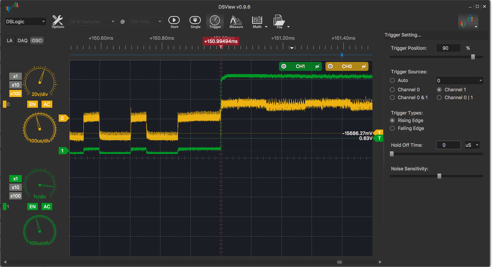
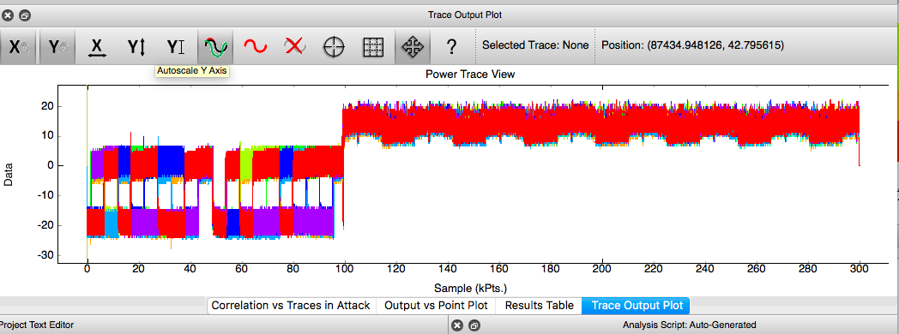
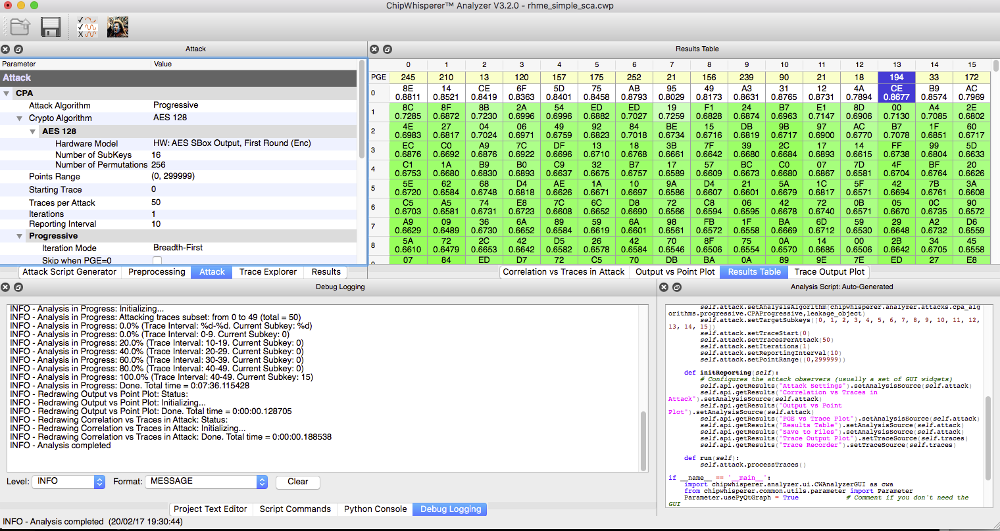

# SCA 100 - Piece of scake

The following description is given for this challenge:

> This is an easy SCA challenge using a cipher implementation without any SCA or DFA countermeasures. Find the key used to encrypt and decrypt messages. Please, consider both SCA and DFA attacks.
> 
> To encrypt a message, send the letter 'e' followed of 16 bytes. To decrypt a message, send the letter 'd' followed of 16 bytes.

The challenge requires side channel analysis. The first step I performed was using the logic analyzer to identify if any of the digital or analogue PINs provided any output during the encryption operation. It turns out that right after input is sent to the board D13 (LED) goes high and right before output is sent is goed low again. This means that D13 can be used as a trigger to identify the code where the encryption is performed.

Apart from the D13 side-channel no other side channels were identified. This leaves one obvious side channel: power usage during encryption/decryption.

In order to measure power usage a simple circuit can be constructed using a 100Ohm shunt resistor connected to the Arduino GND:

```
  5V Power Supply
 Neg           Pos
  |             |
100 Ohm         |
  |             |
  |             |
  GND          +5V
      Arduino
```

In order to improve the quality of the power traces the capacitors that are normally connect to the Arduino's +5V pin need to be removed. This can be done using tweezers and a knife or a soldering iron.

Once the circuit has been created the power consumption can be measured as a voltage across the 100 Ohm resistor. A reasonably fast oscilloscope is required to perform this analysis since it needs to be able to sample at at least 16Hmz which is the clock frequency of the Arduino.

I used a 200Mhz [DSScope](http://www.dreamsourcelab.com/order.html) that I borrowed from a colleague. 

Using the scope we can now setup the D13 pin as a trigger and then capture the voltage across the resistor.

This looks as follows:


The green line is the D13 output and the yellow line the voltage across the 100 Ohm resistor which is related to the power usage of the board.

In order to perform a power analysis attack a number of traces need to be obtained and analysed. In order to do this I wrote a really ugly plugin for ChipWhisperer that uses screen automation to capture 50 traces using the DSView software.

These traces can then be loaded into the ChipWhisperer software:


The initial part (up to about 100 on the horizontal axis) is the serial data being read, after this the AES algorithm is executed and we can observe minimal differences in power usage, based on the input. The ChipWhisperer software can be used to reconstruct the key based on these power differences.

In this case the attack works using the default parameters and 50 traces provided:


The key is obtained using a single execution of the attack.